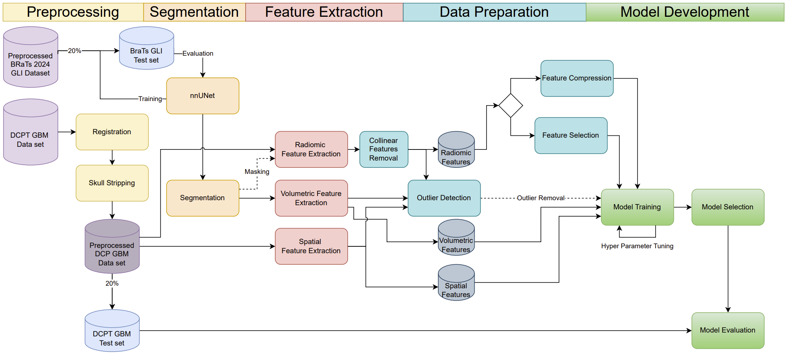
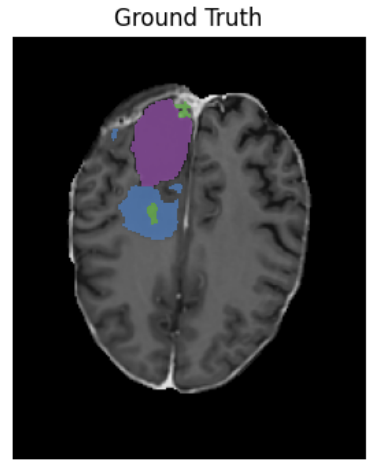
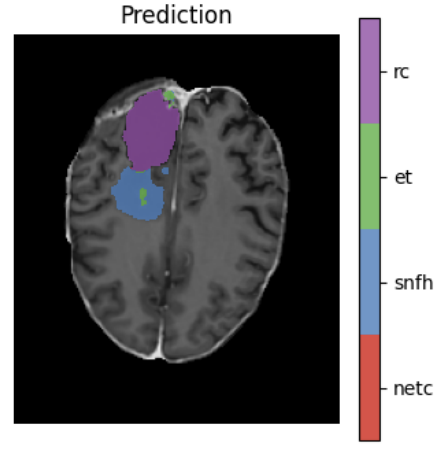
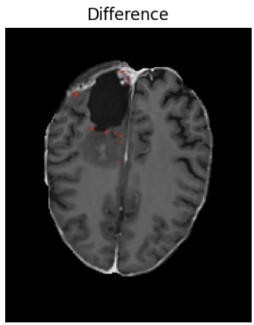
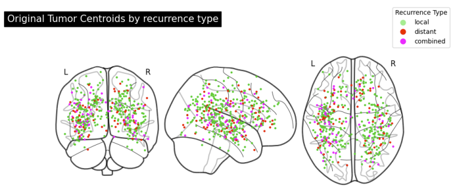
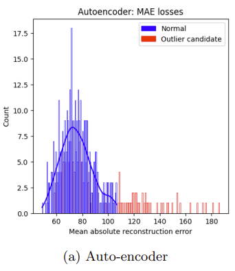
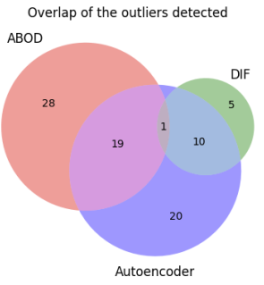
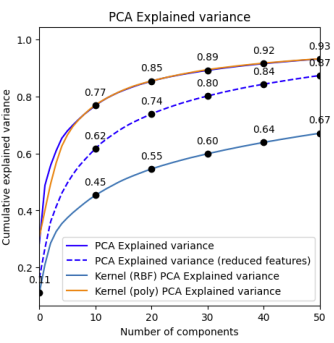
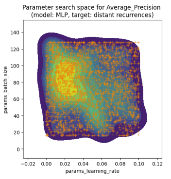
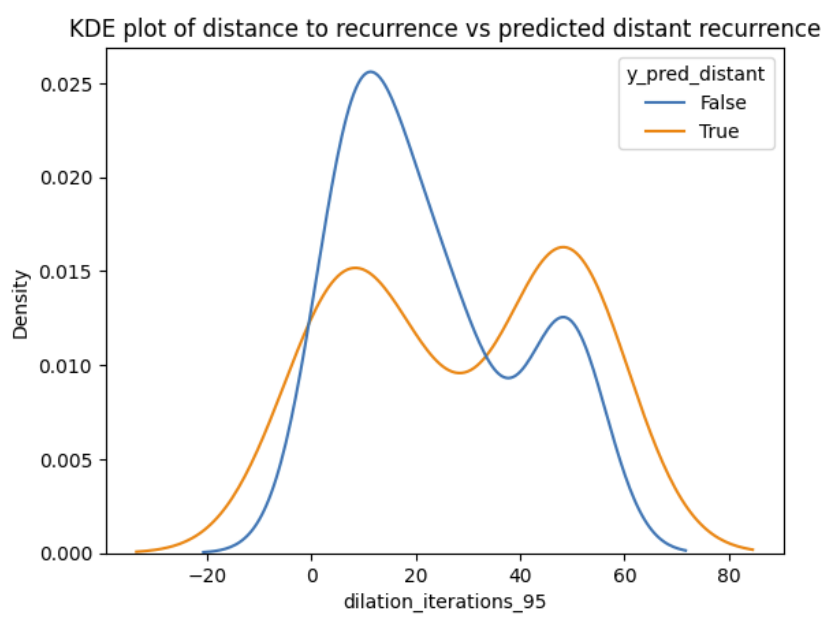

# 🧠 Glioblastoma Recurrence Pattern Classification  
Predicting recurrence types in GBM patients using 3D MRI and machine learning

## 🧾 Abstract
Glioblastoma (GBM) is the most aggressive and common adult brain tumor, characterized by inevitable recurrence. Magnetic resonance imaging is a vitally integrated part of the disease treatment and is subject to extensive ongoing research. Based on a novel dataset with T1ce-MRI from 500 patients treated in Danish hospitals, this project assesses the feasibility of classifying the recurrence pattern by three types of features extracted from the original tumor on MRIs: (1) Spatial coordinates relative to the MNI152 brain atlas; (2) intra-tumor segment volumes, estimated by an UNet-model trained using a single (T1ce) MRI sequence of an external dataset; (3) Radiomic features. The project does not find any combination of the features extracted from the original tumor on T1ceMRI predicative of future recurrence pattern classification.

## 📂 Project Files

> ⚠️ Due to patient privacy, the full report cannot be published

## 🔍 Highlights
- 📚 Based on the largest known GBM recurrence dataset from Danish hospitals
- 🧪 Full pipeline from MRI preprocessing → segmentation → radiomic extraction → ML
- 🧠 Trained nnUNet for intra-tumor segmentation using only T1ce MRI
- 📉 Explored PCA, autoencoders, L1-SVM, and XGBoost for feature reduction
- ❌ No predictive features or models achieved better-than-baseline results
- 🧭 Includes replication attempt of state-of-the-art study

## 🔄 Pipeline

1. 🏥 **Data Collection**: Multi-center medical dataset of >500 GBM patients with T1ce MRI and clinical recurrence labels from Danish hospitals  
2. 🧭 **Rigid Registration**: Registered NIfTI images to MNI152 brain atlas using `SimpleITK` with mutual information & gradient descent  
3. 🧠 **Skull Stripping**: Applied pretrained `HD-BET` (U-Net model) for brain extraction on T1ce MRIs  
4. 🧩 **Intra-Tumor Segmentation**: Trained `nnUNet` on BraTS 2024 post-treatment dataset using only T1ce input  
5. 📍 **Spatial Feature Extraction**: Computed tumor centroid in MNI space (Cartesian & polar) using `nibabel` + affine transforms  
6. 📐 **Volumetric Feature Extraction**: Calculated volumes of ET, NETC, SNFH, and RC subregions across all timepoints  
7. 🔬 **Radiomic Feature Extraction**: Extracted 1700+ features from original & wavelet-transformed images using `PyRadiomics` (GLCM, GLSZM, etc.)  
8. 🔗 **Collinearity Filtering**: Removed redundant features with Pearson correlation ≥ 0.9  
9. 🚨 **Outlier Detection**: Identified outliers using ABOD (`pyod`), Isolation Forest (`sklearn`), and Autoencoder reconstruction error (`PyTorch`)  
10. 📉 **Dimensionality Reduction**:  
    - 🧮 `PCA` and `KernelPCA` (`sklearn`)  
    - 🧠 Custom Autoencoder in `PyTorch` (batch norm, leaky ReLU)  
11. ✂️ **Feature Selection**:  
    - 🔎 L1-SVM (`sklearn`)  
    - 📊 Feature gain from `XGBoost`  
12. ⚖️ **Data Balancing**: Used `SMOTE` (`imblearn`) to handle class imbalance in recurrence types  
13. 🤖 **Model Training**: Built classifiers for recurrence prediction using:  
    - 🌲 `XGBoost` (gradient boosting trees)  
    - 🧠 Custom `MLP` neural network (`PyTorch`)  
14. 🛠 **Hyperparameter Optimization**: Tuned models using `Optuna` with TPE sampler & median pruner  
15. 📈 **Model Evaluation**: Assessed performance via ROC AUC, PR AUC, and confusion matrices (`sklearn`, `matplotlib`)

## 📷 Preview

  
    
  
<i>Fig 3.1: High-level pipeline from data acquisition to classification</i>
  

  
  
  
  
  
<i>Fig 3.7a: T1ce slice difference map (left), ground truth segmentation (middle), predicted segmentation (right)</i>
  

  
    
  
<i>Fig 4.4: Tumor centroid locations mapped to MNI152 brain space grouped by recurrence type</i>
  

  
  
  
  
<i>Fig 5.5: (Left) Autoencoder mean absolute reconstruction error. (Right) Overlap between outlier detection methods</i>
  

  
    
  
<i>Fig 5.6: Explained variance by principal components (PCA)</i>
  

  
    
  
<i>Fig 5.12b: Example of hyperparameter search trajectory using Optuna</i>
  

  
    
  
<i>Fig 5.16: KDE plots of recurrence distance distributions grouped by classifier prediction</i>
  

